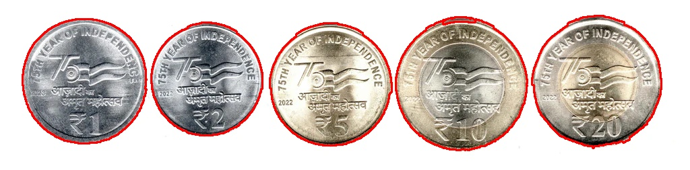
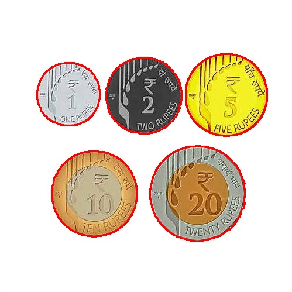
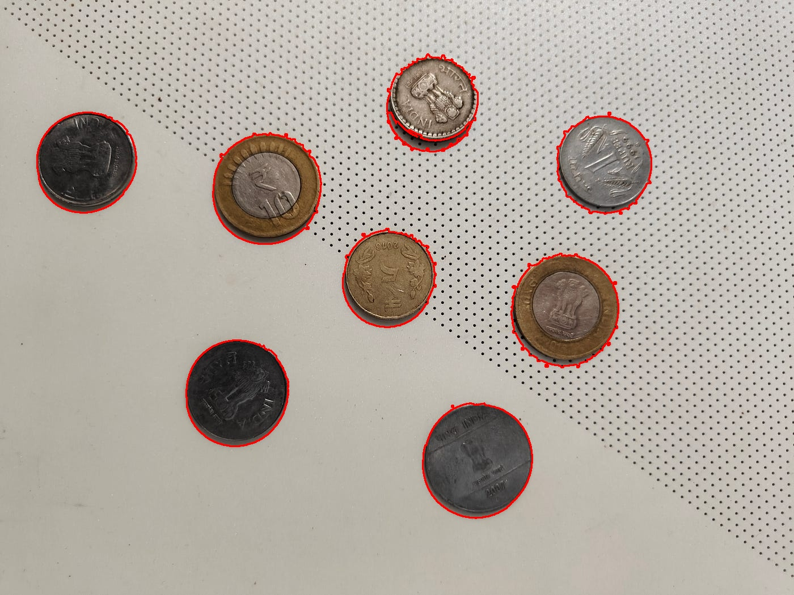
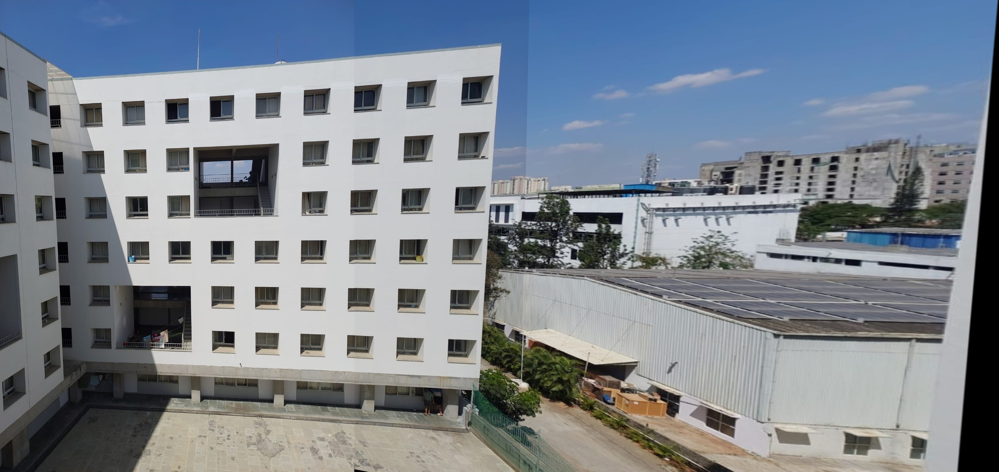
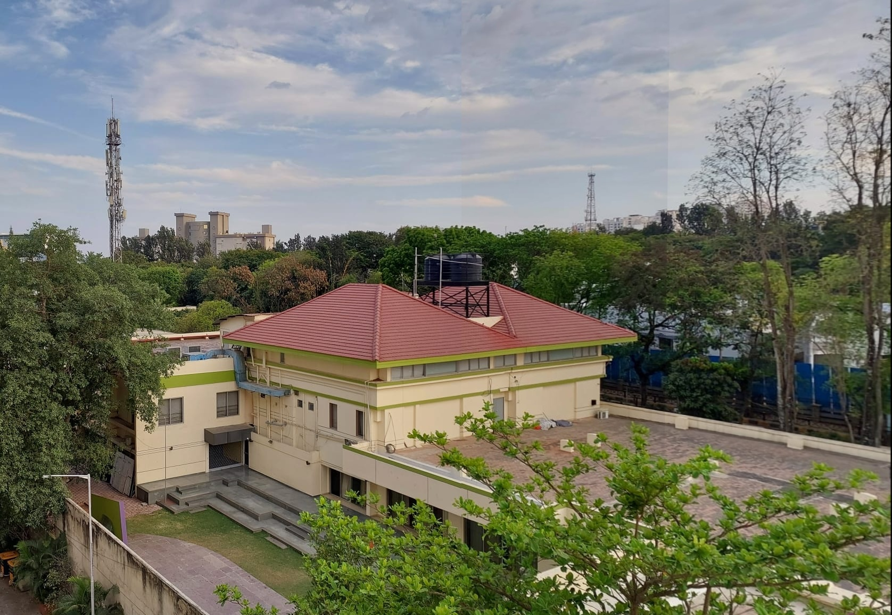
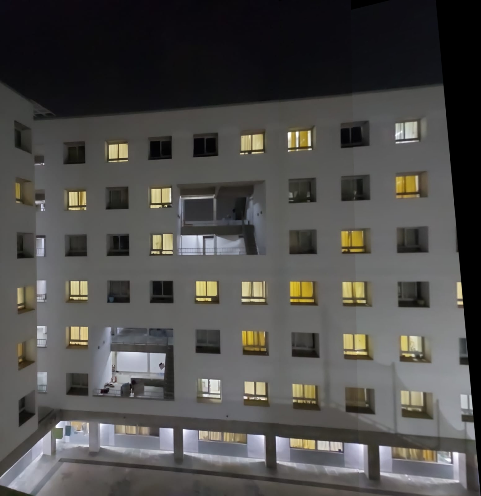

# Virtual Reality Assignment 1: Coin Detection and Panorama Creation

**Author**: Owais
**Roll Number**: IMT2022102

## Table of Contents

1. [Introduction](#introduction)
2. [Repository Structure](#repository-structure)
3. [Dependencies](#dependencies)
4. [How to Run the Code](#how-to-run-the-code)
   - [Coin Detection and Segmentation](#coin-detection-and-segmentation)
   - [Panorama Creation](#panorama-creation)
5. [Methods Used](#methods-used)
   - [Coin Detection and Segmentation](#coin-detection-and-segmentation-methods)
   - [Panorama Creation](#panorama-creation-methods)
6. [Results and Observations](#results-and-observations)
7. [Visual Outputs](#visual-outputs)
8. [Captured Images](#captured-images)

## Introduction

This project includes two primary tasks:

1. **Coin Detection and Segmentation**: Identifying and segmenting coins from images using computer vision techniques.
2. **Panorama Creation**: Stitching multiple images together to form a seamless panoramic image.

## Repository Structure

```
VR_Assignment_1/
│
├── coin_detection.ipynb
├── coin_detection_tests.ipynb
├── image_stitching.ipynb
├── README.md
├── requirements.txt
├── images/
│   ├── center_1.jpg
│   ├── center_2.jpg
│   ├── center_3.jpg
│   ├── coins1.webp
│   ├── coins2.jpg
│   ├── coins3.jpg
│   ├── left_1.jpg
│   ├── left_2.jpg
│   ├── left_3.jpg
│   ├── right_1.jpg
│   ├── right_2.jpg
│   ├── right_3.jpg
│   └── stitched_image.jpg
└── outputs/
    ├── 1_stitched.jpg
    ├── 2_stitched.jpg
    ├── 3_stitched.jpg
    ├── coins1_detected.jpg
    ├── coins2_detected.jpg
    └── coins3_detected.jpg
```

## Dependencies

Ensure you have the following Python libraries installed:

- `numpy`
- `opencv-python`
- `matplotlib`

You can install them using:

```bash
pip install -r requirements.txt
```

## How to Run the Code

### Coin Detection and Segmentation

1. Navigate to the repository directory.
2. Open `coin_detection.ipynb` in Jupyter Notebook:

```bash
jupyter-notebook coin_detection.ipynb
```

### Panorama Creation

1. Navigate to the repository directory.
2. Open `image_stitching.ipynb` in Jupyter Notebook:

```bash
jupyter-notebook image_stitching.ipynb
```

## Methods Used

### Coin Detection and Segmentation Methods

- **Image Preprocessing**: Converted images to grayscale and applied Gaussian blur.
- **Edge Detection**: Used Canny edge detection to identify coin boundaries.
- **Contour Detection**: Detected contours representing potential coins.
- **Filtering**: Filtered contours based on shape properties (e.g., circularity).

### Panorama Creation Methods

- **Feature Detection**: Used SIFT for detecting keypoints and descriptors.
- **Feature Matching**: Matched features using FLANN-based matcher.
- **Homography Estimation**: Computed homography matrices to align images.
- **Image Warping and Blending**: Warped and blended images to create a seamless panorama.

## Results and Observations

- **Coin Detection**: Successfully detected and segmented coins in all images chosen for the task.
- **Panorama Creation**: The stitching algorithm effectively combined 3 images per panorama.

## Visual Outputs

**Coin Detection and Segmentation**:

*Detected Coins Images*:







**Panorama Creation**:

*Stitched Panoramas*:







## Captured Images

All input images used for coin detection and panorama creation are stored in the `images/` directory.
